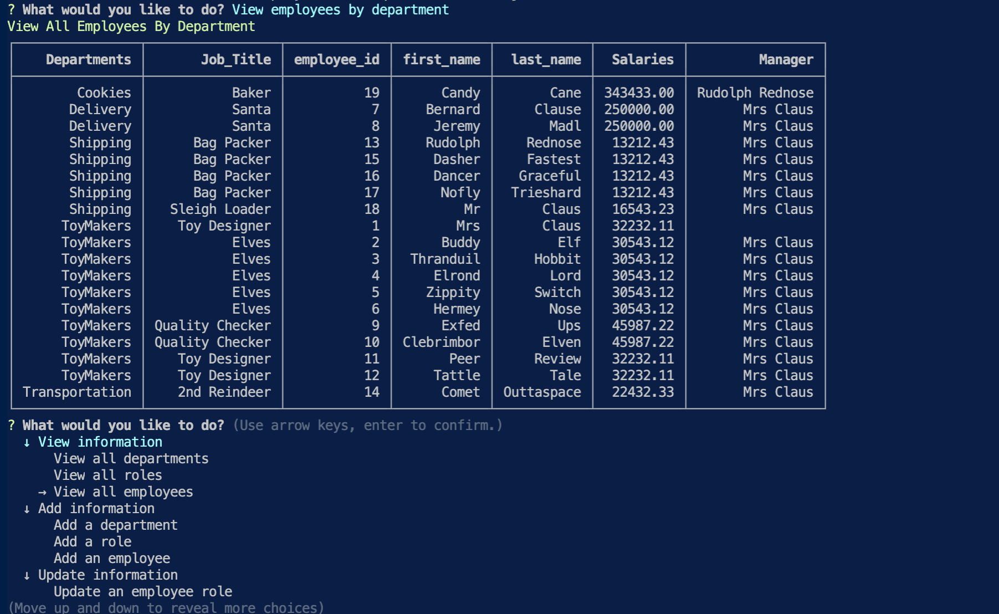

  
  # MYSQL Employee Tracker
  ### As an owner of a large business which includes many departments, employees and managers, it can be difficult to keep track of all the data and who is working where, what are their salaries and who they report to.  This tool allows quick and easy access to data so we can all stay focused on more important tasks of running the business.
  
    
  ## Installation
  Install MySql and Inquirer
  
  ## Usage 
  Content Management System (CMS) used via a Command Line Application which manages a company's emplyee database using Node.js, Inquirer(with Tree Prompt), MySql and PrintTable. 
  * Please review video to see full usage:	https://drive.google.com/file/d/1m5_qLrP6ZsnDSt7mufOWkHM1VwI9iVvB/view?usp=sharing 
  
  
  ## Credits
  D. LeBlanc created 12-19-2021
##
## License  https://opensource.org/licenses/MIT
  ## Contact/Questions
  You can reach me for additional questions at:
  * GitHub: [dleblanc11](https://github.com/dawnleblanc11/employeetrackersql/tree/main
  * Email: dawnleblanc11@gmail.com
## Badges   
    
  ## Features
  Several Ways to View and Update Employee Data
  Via a robust command-line application the user determines the order of transactions
  The choices are as follows:
  * view all departments: a formatted table shows department names and department ids
  * view all roles: a formatted table presented with the job title, role id, the department that role belongs to, and the salary for that role
  * view all employees: a formatted table showing employee data, including employee ids, first names, last names, job titles, departments, salaries, and managers that the employees report to sorted by employee last name
  * view all employees by department: a formatted table showing employee data, including employee ids, first names, last names, job titles, departments, salaries, and managers that the employees report to sorted by department
  * view all employees by manager: a formatted table showing employee data, including employee ids, first names, last names, job titles, departments, salaries, and managers that the employees report to sorted by manager
  * add a department: prompts to enter the name of the department and a table showing that department is added to the database
  * add a role: prompts to enter the name, salary, and department for the role and a table showing that role is added to the database
  * add an employee: prompts to enter the employee’s first name, last name, role, and manager, and a table showing that employee is added to the database
  * update an employee role: prompts to select an employee to update and their new role and a table showing the employees role is updated in the database
  * Calculate utilized budget by department: Displays the combined salaries of all employees in that department

  Coming Soon
  * update employee managers
  * delete departments, roles and employees

  
  ## Contributing  
  contributions welcome
  
  ## Tests
  See Video for a demonstration

